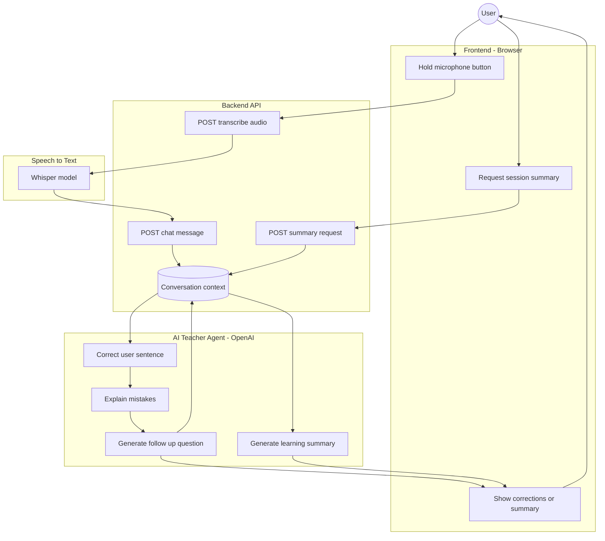

# English Conversational Teacher

An interactive **English Conversational Teacher** web application that helps users practice English through conversation, receive instant corrections, detailed explanations, and a final learning summary. The project pairs a lightweight interface with an AI-driven Python backend to deliver seamless **voice interaction** powered by **automatic speech recognition**.


---

## Features

- Conversational English practice (voice-based interaction)
- Transcription to text with speech recognition model (Wishper, https://openai.com/index/whisper/)
- Instant sentence correction with highlighted improvements
- Clear explanations of grammar, vocabulary, and usage mistakes
- Context-aware follow-up questions
- Session summary with common mistakes and suggested activities
- Press-and-hold speech input
- Fully Dockerized frontend and backend

---

## Application Screenshots

The repository includes screenshots showing:
- Live conversational questions/responses 
- Sentence feedback with corrections and explanations  
- Final session summaries with learning recommendations


---

## Project Structure

```
.
├── backend
│   ├── app
│   │   ├── __init__.py
│   │   ├── chatgpt_client.py
│   │   ├── main.py
│   │   └── speech_to_text.py
│   ├── Dockerfile
│   └── requirements.txt
│
├── frontend
│   ├── html
│   │   ├── index.html
│   │   ├── script.js
│   │   └── style.css
│   ├── Dockerfile
│   └── nginx.conf
│
├── docker-compose.yaml
├── .gitignore
└── README.md
```




---

## Getting Started

### Prerequisites
- Docker
- Docker Compose
- OpenAI API key. Create it, then copy it into the .env file located in the project folder.
  OPENAI_API_KEY = ... (private key).

### Run the application

```bash
docker-compose up --build
```

Open your browser at:

```
http://localhost:8080
```

---

## How It Works

1. User speaks an English sentence.
2. With a speech recognition model, the application transcribes into text what the user said.
3. Backend processes the input using AI.
4. The user receives:
   - A corrected sentence
   - An explanation of mistakes
   - A conversational reply
5. At the end, a session summary highlights common errors and exercises.

---

## License

Educational and experimental use.

---


